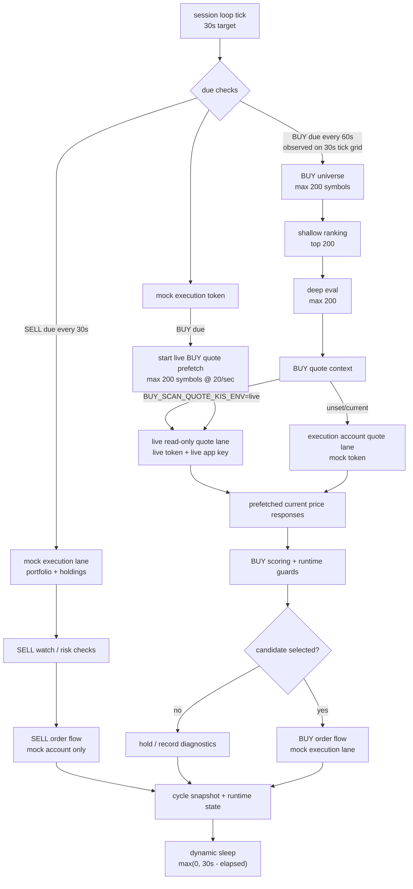

# Current Cycle and Pipeline Map

Updated: 2026-06-27

Scope: checked-in non-secret runtime definitions only. `.env` and token/cache files were not read. No broker/order API or session process was started.

## 0. Short Answer

Yes, the current structure is pipelined, but it is a **single-process lane pipeline**, not two independent trading sessions.

- `live` account lane: BUY scan quote prefetch only.
- `mock` account lane: portfolio, balance, SELL watch, SELL order, BUY order, runtime state.
- The BUY quote prefetch starts early in the cycle after the execution token is ready.
- While live quote prefetch is running, the mock execution lane continues balance and SELL work.
- BUY scoring consumes prefetched live quote payloads, so the scanner does not re-fetch those prices inline.
- The loop no longer sleeps a static 30 seconds after work. It sleeps only the remaining tick budget: `max(0, 30s - elapsed_cycle_time)`.

## 1. Current Cycle Definition

The repeated session loop has two layers:

1. **Engine tick target**: `base_tick_seconds = min(RUN_INTERVAL_SECONDS, SELL_CHECK_INTERVAL_SECONDS, BUY_SCAN_INTERVAL_SECONDS)`, floored at 1 second. After a due cycle, sleep is dynamic: `max(0, base_tick_seconds - cycle_elapsed_seconds)`.
2. **Due checks inside each tick**: SELL and BUY scan each run only when their own interval is due.

Current checked-in regular-session values:

| Item | Current value | Source / meaning |
| --- | ---: | --- |
| `RUN_INTERVAL_SECONDS` | 60s default | Default in `app/auth/settings_fields.py`; not overridden by `config/regular_session.env`. |
| `SELL_CHECK_INTERVAL_SECONDS` | 30s | Regular-session SELL watch cadence. |
| `BUY_SCAN_INTERVAL_SECONDS` | 60s | Regular-session BUY scan cadence. |
| **Engine tick target** | **30s** | `min(60, 30, 60) = 30`; actual sleep subtracts elapsed cycle time. |
| `SCAN_SYMBOLS_MAX_PER_CYCLE` | 200 | BUY scan max symbols per due cycle. |
| `BUY_SCAN_SHALLOW_TOP_K` | 200 | Shallow shortlist size. |
| `BUY_SCAN_DEEP_EVAL_LIMIT` | 200 | Deep evaluation cap. |
| `LIVE_SNAPSHOT_TTL_SECONDS` | 420s | Snapshot freshness TTL. |
| `LIVE_SNAPSHOT_REFRESH_INTERVAL_SECONDS` | 180s | Snapshot refresh cadence. |

Nominal repeated-loop timeline if work finishes inside the 30s target:

```text
t=0s      first repeated tick: SELL due + BUY scan due
t=30s     SELL due
t=60s     SELL due + BUY scan due
t=90s     SELL due
t=120s    SELL due + BUY scan due
```

`BUY_SCAN_INTERVAL_SECONDS=60` lines up with the 30-second engine target, so BUY scan becomes due on roughly every second tick. If a cycle overruns the 30-second target, the next tick starts immediately rather than adding another fixed 30-second sleep.

Dynamic sleep examples:

| Cycle elapsed | Next sleep | Start-to-start target effect |
| ---: | ---: | --- |
| 11s | 19s | next tick starts around 30s after prior tick start |
| 25s | 5s | next tick starts around 30s after prior tick start |
| 30s | 0s | next tick starts immediately |
| 35s | 0s | overrun is not worsened by extra sleep |

## 2. Dynamic Cadence Modes

Runtime rate control starts from the regular-session values, then applies safer limits with `max()` for intervals and `min()` for scan widths.

| Mode | Effective SELL interval | Effective BUY interval | Symbols/cycle | Deep eval | Notes |
| --- | ---: | ---: | ---: | ---: | --- |
| Normal | 30s | 60s | 200 | 200 | Current baseline with separate live BUY quote lane. |
| Midday | 30s | 60s | 200 | 200 | `ADAPTIVE_MIDDAY_SELL_CHECK_INTERVAL_SECONDS=25` does not speed SELL up because intervals use `max(base, adaptive)`. |
| Degraded | 30s | 300s | 16 | 2 | Rate-limit degraded mode slows BUY scan and narrows work; SELL remains 30s because `max(30, 30)=30`. |

Current API pacing definitions:

| Item | Current value |
| --- | ---: |
| `API_SOFT_MAX_REQUESTS_PER_SECOND` | 4 |
| `API_SOFT_MAX_QUOTES_PER_TICK` | 20 |
| `API_MIN_INTER_REQUEST_SECONDS` | 1.10s |
| `API_BUY_SCAN_MIN_REQUEST_RESERVE` | 3 |
| `API_BUY_SCAN_MIN_QUOTE_RESERVE` | 4 |

## 3. Current Pipeline Structure

We now have a split lane for BUY scan quotes:

- **Execution lane: `mock`** keeps portfolio, balance, SELL watch, SELL execution, BUY execution, runtime state, and order logs.
- **BUY quote lane: `live`** handles only BUY scan current-price quote calls when `BUY_SCAN_QUOTE_KIS_ENV=live`.
- BUY quote lane uses live-scoped credentials only (`KIS_APP_LIVE_*`, `KIS_BASE_LIVE_URL`). Generic `KIS_APP_KEY` fallback is intentionally disabled for this lane.
- BUY quote lane bypasses the global execution-account throttle and uses its own local read-only quote throttle:
  - `BUY_SCAN_QUOTE_MAX_REQUESTS_PER_SECOND=20`
  - `BUY_SCAN_QUOTE_MIN_INTER_REQUEST_SECONDS=0.05`
- Live BUY quote prefetch starts immediately after the execution token is ready, while mock balance/SELL work continues on the execution lane.
- Execution-account request metrics remain scoped to mock traffic; BUY prefetch is reported separately via `buy_quote_prefetch_*` timing fields plus `buy_scan_quote_request_count`.



The same flow as a timing sequence:

```mermaid
sequenceDiagram
    participant Loop as session loop
    participant Mock as mock execution lane
    participant Live as live BUY quote lane
    participant Scan as BUY scanner

    Loop->>Mock: issue/reuse execution token
    par BUY due
        Loop->>Live: start quote prefetch, up to 200 symbols
        Live-->>Live: local throttle 20/sec, 0.05s spacing
    and mock account work
        Loop->>Mock: balance and portfolio lookup
        Loop->>Mock: SELL watch quote/evaluation
        Mock-->>Loop: optional SELL candidate/order path
    end
    Loop->>Live: join prefetch before BUY scoring
    Live-->>Scan: prefetched quote payloads
    Scan-->>Loop: ranked BUY candidates
    Loop->>Mock: BUY order flow only if selected and guards pass
    Loop->>Loop: sleep remaining tick budget, not fixed 30s
```

## 4. Lane Ownership

| Work item | Account/lane now |
| --- | --- |
| Portfolio/balance lookup | `mock` execution lane |
| SELL watch quote/evaluation | `mock` execution lane |
| SELL order | `mock` execution lane |
| BUY scan quote lookup | `live` read-only quote lane |
| BUY scoring and candidate filtering | In-process scanner, fed by live quote data |
| BUY order | `mock` execution lane |
| Runtime/cycle snapshots | `mock` account signature context, with BUY quote lane diagnostics attached |

## 5. Practical Caveat

This is not full multi-process parallel trading. It is a first pipeline slice: **single session process, separate read-only BUY quote lane**. If KIS rate limiting is actually enforced by public IP instead of AppKey/account, live/mock lane splitting can still share the same external bucket. Watch for EGW00201 and check cycle snapshots for:

- `last_timing_summary.buy_scan_quote_account_mode`
- `last_timing_summary.buy_scan_quote_account_env`
- `last_timing_summary.buy_quote_prefetch_request_count`
- `last_timing_summary.buy_quote_prefetch_join_wait_ms`
- `buy_scan_quote_request_count`
- `rate_limit_triggered`
- `rate_limit_source`

## 6. Latest Local Simulation Result

Offline simulation with broker/API calls mocked and only the local quote-lane throttle active:

| Metric | Result |
| --- | ---: |
| BUY quote symbols | 200 |
| Completed quotes | 200 |
| Failed quotes | 0 |
| Rate-limit detected | 0 |
| Prefetch elapsed | ~11.05s |
| Theoretical quote-lane floor | ~9.95s |
| Mock execution-lane work overlapped in simulation | ~3.0s |
| Estimated sequential time without overlap | ~14.06s |
| Pipelined wall time in simulation | ~11.05s |

Interpretation: BUY quote prefetch is the dominant timed lane. Mock balance/SELL work can overlap inside that prefetch window, so the BUY+SELL due cycle is expected to stay under the 30-second tick target in normal conditions. If it overruns, dynamic sleep prevents adding an extra fixed 30 seconds.
