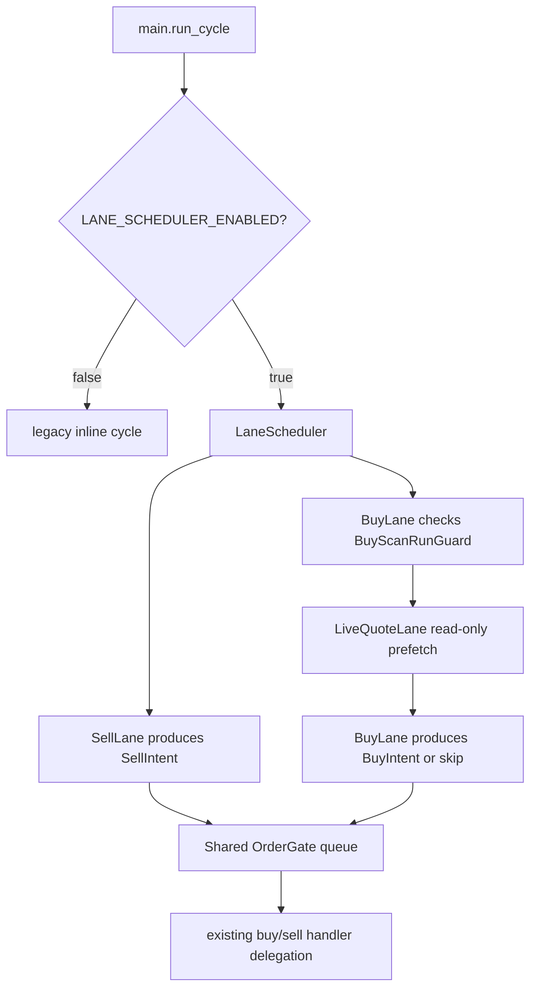

# Lane Pipeline Design

Updated: 2026-06-28

Scope: feature-flagged single-process lane scheduler for mocked regular-session validation. No secret env/token/account files are required for the dry-run tests, no broker API is called, and no real trading session is started.

## Runtime Paths

### Legacy path

- Default path: `LANE_SCHEDULER_ENABLED=false`.
- `app/runtime/session_loop.py` remains a synchronous cadence loop.
- `app/main.py::run_cycle()` still contains the legacy inline SELL/BUY flow when the flag is off.
- Existing order execution internals remain in `app/execution/buy_flow.py` and `app/execution/sell_flow.py`.

### Lane scheduler path

- Enabled by `LANE_SCHEDULER_ENABLED=true`.
- `app/main.py::run_cycle()` enters `app.pipeline.run_lane_scheduler_main_bridge()`,
  which delegates to `run_lane_scheduler_cycle()` and returns through the normal
  runtime state/snapshot finalizer.
- `LaneScheduler` runs `SellLane` before `BuyLane`, then submits both lane intents to one shared `OrderGate`.
- `SellLane` returns a `SellIntent` from an injected/runtime intent factory.
- `BuyLane` checks `BuyScanRunGuard`, runs `LiveQuoteLane`, and returns a `BuyIntent` only when fresh prefetched quote payloads exist.
- `LiveQuoteLane` is read-only and uses quote prefetch only.
- `OrderGate` is the writer/arbitration point for the enabled lane path.
- Order handler timeouts bound scheduler wait time and cycle budget accounting.
  They cancel queued work where possible, but do not forcibly kill a handler
  already running in Python. If SELL consumes the remaining budget, BUY is
  skipped with budget telemetry while SELL priority remains preserved.

## Feature Flags And Budgets

- `LANE_SCHEDULER_ENABLED=false` by default for compatibility.
- `ORDER_GATE_ENABLED=true` remains the order-gate default.
- `SESSION_CYCLE_HARD_BUDGET_SECONDS=60`.
- `BUY_SCAN_TOTAL_BUDGET_SECONDS=25`.
- `BUY_SCAN_QUOTE_PREFETCH_DEADLINE_SECONDS=18`.
- `BUY_SCAN_QUOTE_REQUEST_TIMEOUT_SECONDS=2`.
- `BUY_SCAN_QUOTE_MAX_ATTEMPTS=1`.
- `KIS_TRADER_DISABLE_DOTENV=1` disables `.env` loading for validation.
- `KIS_TRADER_DISABLE_CREDENTIAL_FILES=1` disables credential/token file usage and token-cache read/write behavior.

## Quote-Lane Safety

- `prefetch_buy_scan_prices()` accepts a lane budget and clamps each quote request timeout to the remaining deadline.
- The quote lane passes `request_timeout_seconds` and `max_attempts` into the HTTP path.
- The live quote lane blocks generic credential fallback.
- Missing/deadline-skipped quote payloads are skipped instead of triggering mass inline refetch when the separate quote lane is active.
- Telemetry records request timeout, max attempts, timeout count, budget skipped count, and deadline hits.

## Scheduler Telemetry

The enabled lane path records:

- `lane_scheduler_enabled`
- `sell_lane_running`
- `buy_lane_running`
- `buy_scan_skipped_reason`
- `buy_lane_previous_scan_id`
- `buy_scan_guard_released`
- `buy_scan_guard_release_reason`
- `order_gate_queue_depth`
- `order_gate_processed_count`
- `order_gate_last_decision`
- `order_gate_last_intent_type`
- `order_gate_last_symbol`
- `order_gate_last_skip_reason`
- `cycle_budget_seconds`
- `cycle_budget_remaining_ms`
- `cycle_budget_exceeded`
- `budget_exceeded_stage`
- `cycle_elapsed_ms`
- `buy_quote_prefetch_*`

## Validation Coverage

`tests/test_lane_scheduler_no_hooks.py` exercises the enabled `main.run_cycle()`
path without `lane_scheduler_hooks`; default adapters and default handlers are
verified with broker/order/network boundaries mocked or blocked. Hook-based tests
remain for injection and deadline scenarios.

`tests/test_lane_scheduler_runtime.py` additionally covers hook-injected timing
scenarios:

- Normal 200-symbol BUY+SELL due cycle.
- Slow quote lane/deadline hit.
- Previous BUY still running.
- SELL+BUY conflict through shared `OrderGate`.
- One hanging quote request.
- Exception after prefetch start.
- Missing prefetched payloads.

## Known Limitations

- The legacy path is still present and remains the default.
- The enabled lane scheduler path is validated in mocked regular-session tests,
  including no-hook default-path coverage; live broker/order APIs are not
  exercised by this validation.
- The current scheduler preserves SELL priority by running SELL before BUY inside a single process, not by launching independent OS processes.
