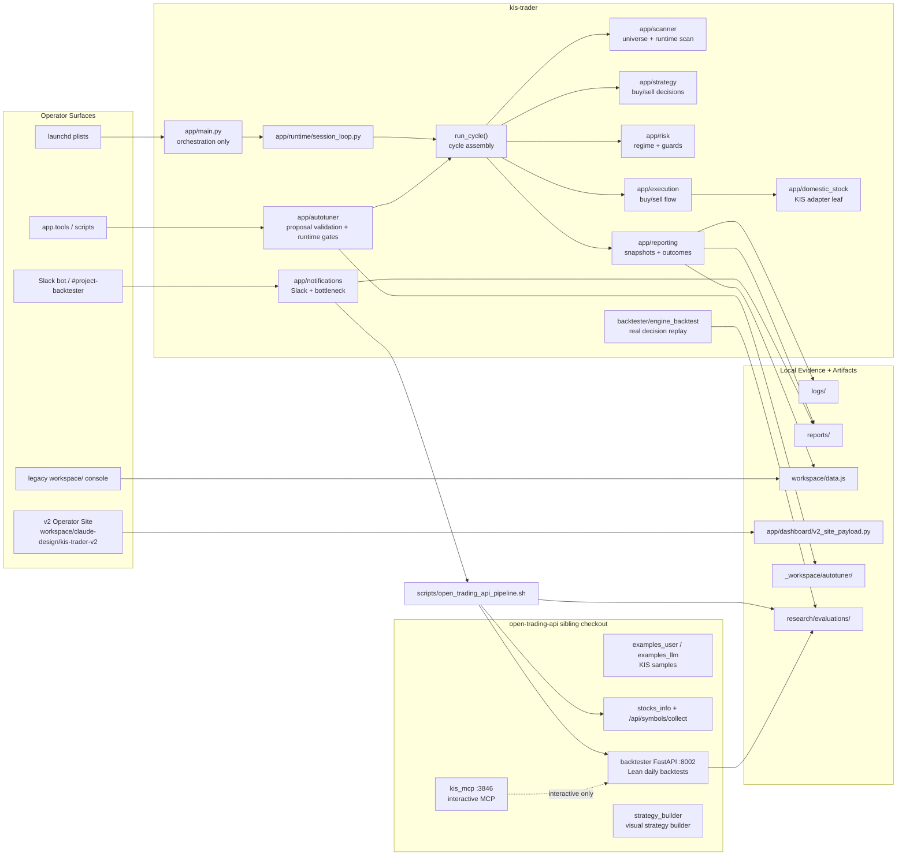
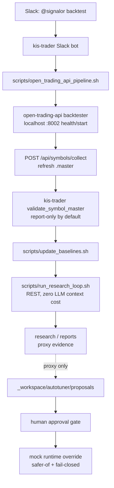
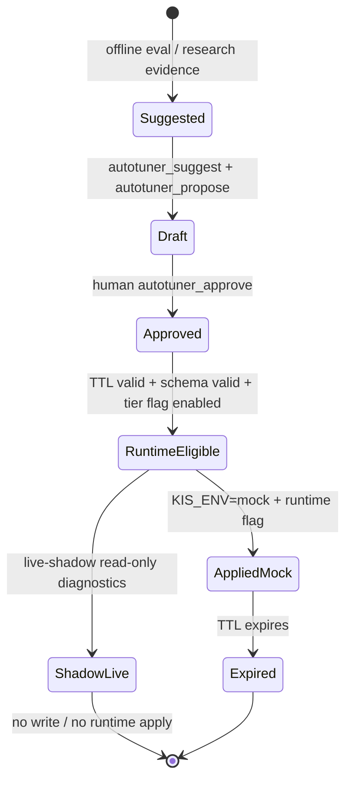

# System Architecture Schema

`kis-trader`는 **트레이딩 런타임과 운영 정책을 소유**한다. `open-trading-api`는 별도 sibling checkout으로 두고, KIS Open API 샘플/마스터 수집/Lean 백테스트/MCP를 제공하는 **research 서비스**로만 사용한다. 두 레포의 의존 방향은 `kis-trader -> open-trading-api` 단방향이다.

## One-Page Picture

```text
=============================================================================================
                                   OPERATOR / INTERFACE SURFACE
       [ launchd ]       [ Slack Bot ]       [ v2 Operator Site ]      [ legacy UI ]
            |                  |                       |                      |
    (Session Launch)     (Backtest Cmd)        (/api/kt-data)           (workspace/)
            |                  |                       |                      |
============|==================|=======================|======================|==============
            v                  v                       |                      |
 +-----------------------+     |                       |                      |
 |      app/main.py      |     |                       |                      |
 | (Orchestration/Lock)  |     |                       |                      |
 +-----------------------+     |                       |                      |
            |                  |                       |                      |
            v                  v                       |                      |
 +------------------------------------------------------------------------------------------+
 | kis-trader                                                                               |
 | ======================================================================================== |
 | [Runtime Session]                                                                        |
 |  app/runtime/session_loop.py -> run_cycle()                                              |
 |       |                                                                                  |
 |       +--> app/scanner/       (Universe / Runtime Scan)                                  |
 |       +--> app/strategy/      (Buy / Sell Decisions)                                     |
 |       +--> app/risk/          (Regime / Guards)                                          |
 |       +--> app/execution/     (Buy / Sell Flow)                                          |
 |       +--> app/domestic_stock/ (KIS Adapter Leaf) ------------------> [ KIS Open API ]   |
 |       |                                                                                  |
 |       +--> app/reporting/ + app/notifications/                                           |
 |              |                                                                           |
 |              v                                                                           |
 |        [logs/] [reports/] [workspace/data.js]                                            |
 |                                                                                          |
 | [Slack Backtest Path]                                                                    |
 |  #project-backtester: @signalor backtest [date]                                         |
 |       |  channel + user allowlist + single-flight pid                                    |
 |       v                                                                                  |
 |  app/notifications/slack_bot.py                                                          |
 |       |  spawn env-allowlisted wrapper                                                   |
 |       v                                                                                  |
 |  scripts/open_trading_api_pipeline.sh          (orchestration owner: kis-trader)          |
 |       |                                                                                  |
 |       +--> 1. :8002 health/start                                                         |
 |       +--> 2. POST /api/symbols/collect                                                  |
 |       +--> 3. validate_symbol_master (report-only by default)                            |
 |       +--> 4. update_baselines.sh                                                        |
 |       +--> 5. run_research_loop.sh -- REST -----------------------------+                |
 |                                                                        |                |
 |                                                                        v                |
 | [Autotuner Gate]                                      [open-trading-api sibling :8002]  |
 |  operational eval + live_log evidence                  Lean Daily / DSL approximation   |
 |       |                                                proxy evidence only              |
 |       v                                                                 |                |
 |  autotuner_screen -> autotuner_suggest -> autotuner_propose             v                |
 |       |                                           [research-domain evals]                |
 |       v                                            family / param_id / new_value         |
 |  _workspace/autotuner/proposals/                                                         |
 |       |  human approval only                                                             |
 |       v                                                                                  |
 |  autotuner_approve -> approved bundle with TTL                                           |
 |       |  mock-only runtime flag + safer-of + fail-closed                                  |
 |       v                                                                                  |
 |  app/autotuner/runtime_activation.py -> run_cycle settings                               |
 |                                                                                          |
 | [Internal Replay]                                                                        |
 |  backtester/engine_backtest/ + parity                                                    |
 |  uses real kis-trader decision functions; strategy logic verification lives here          |
 +------------------------------------------------------------------------------------------+
            |                             |                                  |
============|=============================|==================================|==============
            v                             v                                  v
 +------------------------------------------------------------------------------------------+
 | DATA & ARTIFACTS                                                                         |
 | [logs/] [reports/] [research/evaluations/] [_workspace/autotuner/] [workspace/data.js]   |
 +------------------------------------------------------------------------------------------+

=============================================================================================
                         OPEN-TRADING-API SIBLING CHECKOUT / RESEARCH DOMAIN
 +------------------------------------------------------------------------------------------+
 | [FastAPI Backtester :8002]                                                               |
 |  - /api/health                                                                           |
 |  - /api/symbols/collect (.master refresh)                                                |
 |  - Lean daily backtests from .kis.yaml / DSL approximation                               |
 |                                                                                          |
 | [MCP :3846]                                                                              |
 |  Claude/Codex -> kis_mcp -> one-off exploration only                                     |
 |  No authority over the recurring Slack/cron pipeline                                     |
 +------------------------------------------------------------------------------------------+

Structural separation:
  open-trading-api research evals do NOT directly feed autotuner screening.
  They can be attached as proxy evidence, but operational eval + live_log is
  the high-trust path for runtime override approval.
```

## Top-Level Map



## Repository Roles

| Area | Owner | Role | Runtime authority |
| --- | --- | --- | --- |
| Trading session | `kis-trader` | Session lock, schedule, cycle orchestration, scan/strategy/risk/execution | Yes, mock/live gated |
| Broker/KIS adapter | `kis-trader/app/domestic_stock` | Leaf API adapter for quote/order/balance/orderable calls | Yes, only through guarded runtime paths |
| Operator UI | `workspace/claude-design/kis-trader-v2`, `app/dashboard` | Primary read-only v2 site backed by local dashboard payloads | No writes to trading state |
| Legacy UI | `workspace/` | Static console fallback during v2 migration | No writes to trading state |
| Slack operations | `kis-trader/app/notifications/slack_bot.py` | Backtest command, alerts, EOD/rate-limit visibility | Starts local tools only through allowlisted scripts |
| Autotuner | `kis-trader/app/autotuner` | Suggest/propose/approve/runtime override gate | Mock-first, default-off, human-approved |
| Internal replay backtest | `kis-trader/backtester/engine_backtest` | Replays actual `evaluate_*_decision` logic against historical records | Evidence only |
| External Lean backtest | sibling `open-trading-api/backtester` | Daily-resolution proxy research through localhost REST/MCP | Evidence only |
| KIS samples/master data | sibling `open-trading-api` | Upstream examples and external `.master` collection | No direct runtime authority in kis-trader |

## Runtime Session Flow

```mermaid
sequenceDiagram
    participant Operator
    participant Launchd as launchd/run_session
    participant Main as app.main
    participant Loop as session_loop
    participant Cycle as run_cycle
    participant Modules as scanner/strategy/risk/execution
    participant KIS as KIS Open API
    participant Artifacts as logs/reports/workspace

    Operator->>Launchd: enable or restart session
    Launchd->>Main: start app entrypoint
    Main->>Main: acquire_app_main_lock()
    Main->>Loop: delegate session timing/rate control
    Loop->>Cycle: run each trading cycle
    Cycle->>Modules: scan, decide, guard, execute
    Modules->>KIS: broker-facing calls through adapters
    Cycle->>Artifacts: snapshots, candidate outcomes, summaries
```

`app/main.py`는 와이어링과 상위 오케스트레이션만 담당한다. 새 로직은 `app/<package>/`에 둔다. 자세한 모듈 역할은 [ARCHITECTURE.md](ARCHITECTURE.md)를 본다.

## Backtest And Research Flow



The normal automated path is **Slack -> kis-trader wrapper -> open-trading-api REST -> local evidence**. MCP is reserved for interactive exploration inside an AI chat, not for the recurring Slack/cron research pipeline.

## Three Evidence Engines

| Engine | What it proves | What it does not prove | Evidence weight |
| --- | --- | --- | --- |
| `open-trading-api/backtester` | Market regime and parameter direction under Lean daily data | Intraday live strategy parity | Proxy / low |
| `kis-trader/backtester/engine_backtest` | Actual kis-trader decision-function replay and log parity | Full live microstructure or order-book behavior | Medium |
| Operational eval / EOD / live logs | Real mock/live runtime behavior, cadence, bottlenecks, stop-loss/reentry outcomes | Counterfactual strategy alternatives by itself | High |

Rule of thumb: **strategy logic change -> `engine_backtest` + parity; parameter direction exploration -> `open-trading-api`; autotuner approval -> operational eval + live_log evidence.**

## Autotuner Gate



Autotuner invariants:

- Default off: no runtime override without explicit env flags.
- Mock first: runtime application is mock-only unless a separate live gate is opened.
- Human approval: proposals do not self-promote.
- Safer-of and fail-closed: ambiguous/expired/multiple active bundles do not apply.
- Tier C/high-risk live expansion remains a separate project gate.

Current rollout details live in [autotuner_rollout_plan.md](OLD/autotuner_rollout_plan.md).

## Trust Boundaries

| Boundary | Rule |
| --- | --- |
| Secrets | Do not read, print, edit, or commit `.env`, token caches, or external KIS credential files. |
| Broker/order APIs | Agents do not call broker/order/session entrypoints. Runtime paths own those calls. |
| `app/main.py` | Orchestration only. New behavior belongs in `app/<package>/`. |
| External repo | `open-trading-api` is resolved by explicit env/config and treated as external evidence, not runtime policy. |
| Backtester URL | Localhost-only. Remote backtester URLs are not trusted. |
| Slack backtest command | Local process launch surface; must be guarded by channel/user config and single-flight pid handling. |
| Operator Site | `workspace/claude-design/kis-trader-v2/` is the default read-only operator site; it serves `/api/kt-data` from `app.dashboard.v2_site_payload`. |
| Workspace UI | `workspace/` is a legacy read-only operator shell fed by generated local snapshots. |

## Key Paths

| Path | Purpose |
| --- | --- |
| `app/main.py` | Top-level session and cycle orchestration. |
| `app/runtime/session_loop.py` | Session loop timing, pacing, and repeated cycle execution. |
| `app/scanner/`, `app/strategy/`, `app/risk/`, `app/execution/` | Core trading decisions and execution flow. |
| `app/domestic_stock/` | KIS domestic-stock adapter leaf modules. |
| `app/notifications/` | Slack alerts, rate-limit/bottleneck notifications, Slack command bot. |
| `app/autotuner/` | Proposal validation, approval/runtime activation, diagnostics. |
| `app/integrations/open_trading_api/` | Safe adapter for sibling repo discovery, bounded reads, localhost policy. |
| `scripts/open_trading_api_pipeline.sh` | Operator/Slack wrapper for external research loop. |
| `backtester/engine_backtest/` | Internal replay engine using kis-trader decision functions. |
| `workspace/claude-design/kis-trader-v2/` | Primary read-only v2 operator site preview/server. |
| `workspace/` | Legacy static operator console shell. |
| `_workspace/autotuner/` | Autotuner baselines and proposal artifacts. |
| `reports/`, `logs/`, `research/` | Runtime reports, raw evidence, and research outputs. |
| sibling `open-trading-api/backtester/` | External FastAPI/Lean backtester and MCP server. |

## Read Next

- [ARCHITECTURE.md](ARCHITECTURE.md) — kis-trader module ownership and `main.py` boundary.
- [runbook_open_trading_api.md](runbook_open_trading_api.md) — operator commands for the sibling backtester bridge.
- [open_trading_api_architecture_review.md](OLD/open_trading_api_architecture_review.md) — deeper review of the current bridge and hardening backlog.
- [autotuner_rollout_plan.md](OLD/autotuner_rollout_plan.md) — staged rollout gate for runtime overrides.
- [OPERATIONS.md](OPERATIONS.md) — regular session and EOD operations.
